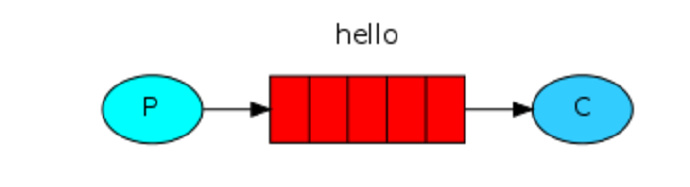
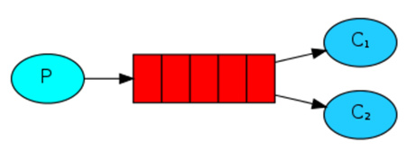
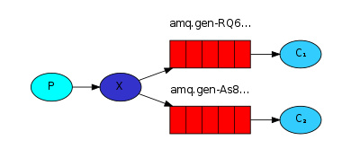
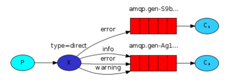
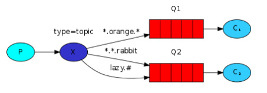
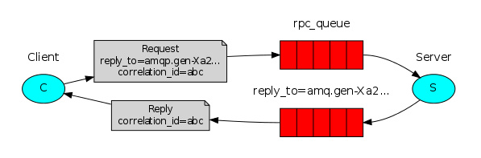

# RabbitMQ 消息队列之队列模型

RabbitMQ提供如下5种队列模型

## 1."Hello World!". 

简单模式

## 2.Work Queues (又名: Task Queues) . 

工作队列，在消费者之间分配任务(竞争的消费者模式)，一个消息只能被一个消费者获取。

          
## 3.Publish/Subscribe. 

订阅模式，消息被路由投递给多个队列，同一个消息被多个消费者获取，以达到同时向多个消费者发送消息的目的。`ExchangeType` 为 `fanout`。

## 4.Routing. 

路由模式，消费者可以有选择地接收消息。`ExchangeType` 为 `direct`。

当消费者的 `binding key` 与 `Exchange` 的 `Routing Key` 匹配时则消费者可以接收到该消息。

## 5.Topic. 

通配符模式，一个消息被多个消费者获取。消息的目的 `queue` 可用 `BindingKey` 以通配符(#：一个或多个词，*：一个词)的方式指定。`ExchangeType` 为 `topic`。

  
## 6.PRC. 

远程调用

    远程调用不属于队列模型
    

