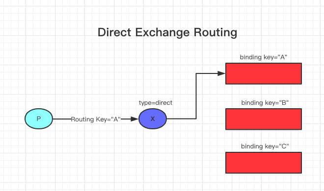
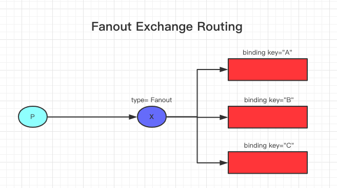
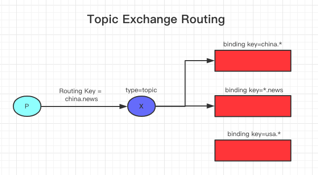
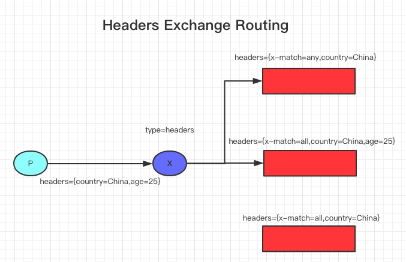

# 写在前面
    RabbitMQ遵循AMQP 0-9-1协议 
## AMQP 0-9-1协议简介
消息发布到交换站，这通常被比作邮局或邮箱。然后交换器使用称为绑定的规则将消息副本分发到队列。然后，AMQP代理将消息传递给订阅队列的消费者，或者根据需要从队列中获取消息。

发布消息时，发布者可以指定各种消息属性(消息元数据)。这些元数据中的一些可能由代理使用，但是，其他部分对代理完全不透明，仅供接收消息的应用程序使用。

网络是不可靠的，应用程序可能无法处理消息，因此 AMQP 模型有消息确认的概念:当消息被交付给使用者时，使用者会自动通知代理，或者只要应用程序开发人员选择这样做就会通知代理。在使用消息确认时，代理只会在收到该消息(或消息组)的通知时从队列中完全删除消息。

例如，在某些情况下，当消息不能被路由时，消息可能被返回给发布者或者删除，如果代理实现了扩展，则将消息放入所谓的 `dead letter queue` 中。发布者通过使用某些参数发布消息来选择如何处理这种情况。

队列、交换和绑定统称为AMQP实体。

# 简介
交换机是发送消息的AMQP实体。交换机获取消息并将其路由到零或多个队列。所使用的路由算法取决于交换类型（Exchange Types）和被称为绑定（Bindings）的规则。AMQP 0—9-1协议提供四种交换类型：

- Direct exchange
- Fanout exchange	
- Topic exchange
- Headers exchange

# Default Exchange
Default Exchange 是由代理预先声明的无名称（空字符串）的直接交换。它有一个特殊的属性，使得它对于简单的应用程序非常有用：每一个创建的队列都自动绑定到路由键(Routing Key)为队列名称(Queue Name)的交换机。

# Direct Exchange

Direct Exchange 基于消息路由键将消息传递到队列。直接交换对于消息的单播路由来说是理想的（尽管它们也可以用于多播路由）。它的运作方式如下：

队列绑定到具有路由键(Routing Key) K 的交换机。

当具有路由键(Routing Key) R 的新消息到达直接交换时，如果 K = R，则将其路由到队列。

直接交换通常用于以循环方式在多个 workers（同一应用程序的实例）之间分配任务。当这样做时，消息在消费者之间而不是在队列之间是负载平衡的。

# Fanout Exchange

`Fanout Exchange` 将消息路由到绑定到它的所有队列，并且忽略路由键(Routing Key) 。如果N个队列绑定到`Fanout Exchange`，则当向该交换机发布新消息时，将向所有N个队列传递消息的副本。`Fanout Exchange` 是广播消息路由的理想选择。

`Fanout Exchange` 向每个绑定到它的队列传递消息副本，适用场景如下：

- 大型多人在线（MMO）游戏可用于排行榜更新或其他全球性事件。

- 体育新闻网站可以使用 `Fanout Exchange` 来实时更新移动客户端的评分更新。

- 分布式系统可以广播各种状态和配置更新
 
# Topic Exchange

`Topic Exchange` 基于消息路由键(Routing Key)和用于将队列绑定到交换机的模式之间的匹配，将消息路由到一个或多个队列。`Topic Exchange` 通常用于实现各种发布/订阅模式变化。`Topic Exchange` 通常用于消息的多播路由。

每当问题涉及多个消费者/应用程序，它们有选择地选择它们想要接收哪种类型的消息时，应该考虑使用 `Topic Exchange`。

示例用途：

- 分配与特定地理位置相关的数据，例如销售点

- 后台任务处理由多个工人完成，每个任务都能够处理特定的任务集。

- 股票价格的更新（以及其他类型的金融数据的更新）

- 涉及分类或标记的新闻更新（例如，仅针对特定的运动或团队）

- 云中不同类型服务的编排

- 分布式体系结构/ OS特定的软件构建或打包，其中每个构建器只能处理一个体系结构或操作系统。

# Headers Exchange

`Headers Exchange`被设计用于在多个属性上进行路由，这些属性比路由键(Routing Key)优先级更高。`Headers Exchange`忽略路由键属性。相反，用于路由的属性是从头属性获取的。如果报头的值等于绑定时指定的值，则认为消息是匹配的。

可以使用多个报头将队列绑定到头交换，以便进行匹配。在这种情况下，代理需要应用程序开发人员提供一条信息，即，它是否应该考虑与任何头部匹配的消息，或者所有头部匹配的消息？这就是 `x-match` 绑定的论点。当 `x-match` 参数设置为 `any` 时，只有一个匹配的头值就足够了。或者，将 `x-match` 设置为 `all` 则所有的值必须匹配。

